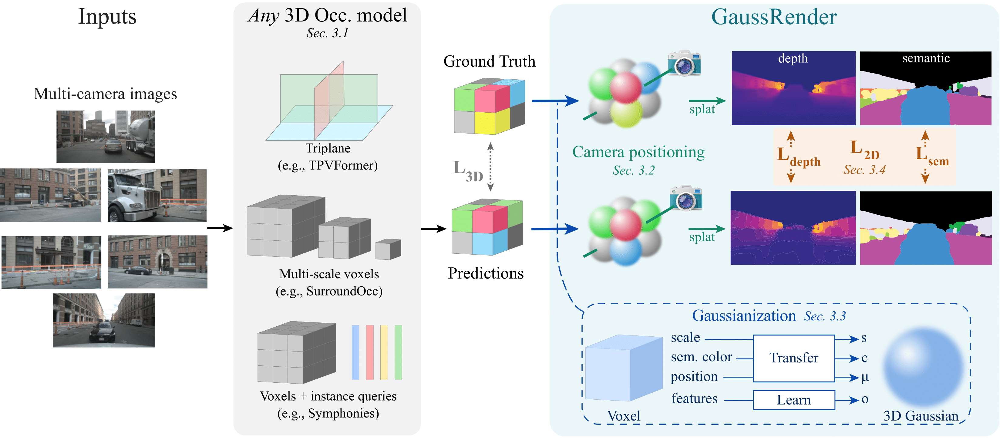

# Official implementation of: *GaussRender: Learning 3D Occupancy with Gaussian Rendering.* 
<p align="center">
  <a href="https://arxiv.org/abs/2502.05040">
    
  </a>
</p>

> [**GaussRender: Learning 3D Occupancy with Gaussian Rendering.**](https://arxiv.org/abs/2502.05040)<br>
> [Loick Chambon](https://loickch.github.io/)<sup>1,2</sup>, [Eloi Zablocki](https://scholar.google.fr/citations?user=dOkbUmEAAAAJ&hl=fr)<sup>2</sup>, [Alexandre Boulch](https://boulch.eu/)<sup>2</sup>, [Mickael Chen](https://sites.google.com/view/mickaelchen/)<sup>3</sup>, [Matthieu Cord](https://cord.isir.upmc.fr/)<sup>1,2</sup>.<br> <sup>1</sup>Valeo.ai, <sup>2</sup>Sorbonne University, <sup>3</sup>Hcompany.ai.

<table>
  <tr>
    <td align="center" width="50%">
      
    </td>
    <td align="center" width="50%">
      
    </td>
  </tr>
  <tr>
    <td colspan="2" align="center">
      <em>GaussRender is a 3D Occupancy module that can be plugged into any 3D Occupancy model to enhance its predictions and ensure 2D-3D consistency while improving mIoU, IoU, and RayIoU.</em>
    </td>
  </tr>
</table>

# Abstract

*Understanding the 3D geometry and semantics of driving scenes is critical for safe autonomous driving. Recent advances in 3D occupancy prediction have improved scene representation but often suffer from spatial inconsistencies, leading to floating artifacts and poor surface localization. Existing voxel-wise losses (e.g., cross-entropy) fail to enforce geometric coherence. In this paper, we propose GaussRender, a module that improves 3D occupancy learning by enforcing projective consistency.  Our key idea is to project both predicted and ground-truth 3D occupancy into 2D camera views, where we apply supervision. Our method penalizes 3D configurations that produce inconsistent 2D projections, thereby enforcing a more coherent 3D structure. To achieve this efficiently, we leverage differentiable rendering with Gaussian splatting. GaussRender seamlessly integrates with existing architectures while maintaining efficiency and requiring no inference-time modifications. Extensive evaluations on multiple benchmarks (SurroundOcc-nuScenes, Occ3D-nuScenes, SSCBench-KITTI360) demonstrate that GaussRender significantly improves geometric fidelity across various 3D occupancy models (TPVFormer, SurroundOcc, Symphonies), achieving state-of-the-art results, particularly on surface-sensitive metrics. The code is open-sourced at https://github.com/valeoai/GaussRender.*


<table>
  <tr>
    <td align="center">
      
    </td>
  </tr>
  <tr>
    <td align="center">
      <em>GaussRender can be plugged to any model. The core idea is to transform voxels into gaussians before performing a depth and a semantic rendering.</em>
    </td>
  </tr>
</table>

## Updates:
* 【19/03/2025】 [GaussRender](https://arxiv.org/abs/2502.05040) code has been uploaded.
* 【07/02/2025】 [GaussRender](https://arxiv.org/abs/2502.05040) is on arxiv.

## ⌛ Todo:
-  Release other checkpoints.

# 🚀 Main results

## 🔥 3D Occupancy
GaussRender can be plugged into any 3D model. We have dedicated experiments on multiple 3D benchmarks (SurroundOcc-nuScenes, Occ3D-nuScenes, SSCBench-KITTI360) and on multiple models (TPVFormer, SurroundOcc, Symphonies) to evaluate its performance.

### Occ3d-nuScenes

<div align="center">
<table border="1">
  <caption><i>3D mIoU and IoU of several models on the Occ3D-nuScenes dataset. Best result marked with 🥇, second best with 🥈.</i></caption>
    <tr>
        <th>Models</th>
        <th><a href="https://arxiv.org/abs/2502.05040">TPVFormer (ours) </a></th>
        <th><a href="https://arxiv.org/abs/2302.07817">TPVFormer </a></th>
        <th><a href="https://arxiv.org/abs/2502.05040">SurroundOcc (ours) </a></th>
        <th><a href="https://arxiv.org/abs/2303.09551">SurroundOcc </a></th>
        <th><a href="https://arxiv.org/abs/2304.05316">OccFormer</a></th>
        <th><a href="https://arxiv.org/abs/2309.09502">RenderOcc</a></th>
    </tr>
    <tr>
      <th> Type </th>
      <th> w/ GaussRender </th>
      <th> base </th>
      <th> w/ GaussRender </th>
      <th> base </th>
      <th> base </th>
      <th> base </th>
    </tr>
    <tr class="highlight-column">
        <td>mIoU</td>
        <td>30.48 🥇</td>
        <td>27.83</td>
        <td>30.38 🥈</td>
        <td>29.21</td>
        <td>21.93</td>
        <td>26.11</td>
    </tr>
    <tr class="highlight-column">
        <td>RayIoU</td>
        <td>38.3 🥇</td>
        <td>37.2</td>
        <td>37.5 🥈</td>
        <td>35.5</td>
        <td>-</td>
        <td>19.5</td>
    </tr>
</table>
</div>

### SurroundOcc-nuScenes

<div align="center">
<table border="1">
  <caption><i>3D mIoU and IoU of several models on the SurroundOcc-nuScenes dataset. Best marked with 🥇, second with 🥈.</i></caption>
    <tr>
        <th>Models</th>
        <th><a href="https://arxiv.org/abs/2502.05040">TPVFormer (ours) </a></th>
        <th><a href="https://arxiv.org/abs/2302.07817">TPVFormer </a></th>
        <th><a href="https://arxiv.org/abs/2502.05040">SurroundOcc (ours) </a></th>
        <th><a href="https://arxiv.org/abs/2303.09551">SurroundOcc </a></th>
        <th><a href="https://arxiv.org/abs/2304.05316">OccFormer</a></th>
        <th><a href="https://arxiv.org/abs/2412.04384">GaussianFormerv2</a></th>
    </tr>
    <tr>
      <th> Type </th>
      <th> w/ GaussRender </th>
      <th> base </th>
      <th> w/ GaussRender </th>
      <th> base </th>
      <th> base </th>
      <th> base </th>
    </tr>
    <tr class="highlight-column">
        <td>IoU</td>
        <td>32.05 🥈</td>
        <td>30.86</td>
        <td>32.61 🥇</td>
        <td>31.49</td>
        <td>31.39</td>
        <td>30.56</td>
    </tr>
    <tr class="highlight-column">
        <td>mIoU</td>
        <td>20.58 🥈</td>
        <td>17.10</td>
        <td>20.82 🥇</td>
        <td>20.30</td>
        <td>19.03</td>
        <td>20.02</td>
    </tr>
</table>
</div>

### SSCBench-KITTI360

<div align="center">
<table border="1">
  <caption><i>3D mIoU and IoU of several models on SSCBench-KITTI360. Best 🥇, second 🥈.</i></caption>
    <tr>
        <th>Models</th>
        <th><a href="https://arxiv.org/abs/2502.05040">SurroundOcc (ours) </a></th>
        <th><a href="https://arxiv.org/abs/2303.09551">SurroundOcc </a></th>
        <th><a href="https://arxiv.org/abs/2502.05040">Symphonies (ours) </a></th>
        <th><a href="https://arxiv.org/abs/2306.15670">Symphonies </a></th>
        <th><a href="https://arxiv.org/abs/2304.05316">OccFormer</a></th>
        <th><a href="https://arxiv.org/abs/2112.00726">MonoScene</a></th>
    </tr>
    <tr>
      <th> Type </th>
      <th> w/ GaussRender </th>
      <th> base </th>
      <th> w/ GaussRender </th>
      <th> base </th>
      <th> base </th>
      <th> base </th>
    </tr>
    <tr class="highlight-column">
        <td>IoU</td>
        <td>38.62</td>
        <td>38.51</td>
        <td>44.08 🥇</td>
        <td>43.40 🥈</td>
        <td>40.27</td>
        <td>37.87</td>
    </tr>
    <tr class="highlight-column">
        <td>mIoU</td>
        <td>13.34</td>
        <td>13.08</td>
        <td>18.11 🥇</td>
        <td>17.82 🥈</td>
        <td>13.81</td>
        <td>12.31</td>
    </tr>
</table>
</div>

# 🔨 Setup <a name="setup"></a>

## ➡️ Install
<details>
  <summary>Environment</summary>

```
# Create basic env
micromamba create -n gaussrender python=3.8.16 -y -c conda-forge
micromamba activate gaussrender

# Install torch
pip install torch==2.0.0 torchvision==0.15.1 --index-url https://download.pytorch.org/whl/cu118

# Install mmlibs.
pip install -U openmim
mim install mmcv==2.0.1
mim install mmdet==3.0.0
mim install "mmdet3d==1.1.1" 
mim install "mmsegmentation==1.0.0"

# Install other libraries
pip install uv
uv pip install pillow==8.4.0 typing_extensions==4.8.0 torchmetrics==0.9.3 timm==0.9.2
uv pip install spconv-cu118 einops ipykernel
uv pip install protobuf==4.25.3

# Compile extensions
cd extensions/diff-gaussian-rasterization
rm -r build dist
python setup.py build install
cd -
```
</details>

## ➡️ Dataset

<details>
  <summary> Occ3d-nuScenes</summary>

Follow instructions on the official repository [here]([url](https://github.com/Tsinghua-MARS-Lab/CVT-Occ/blob/main/docs/dataset.md)).

1. Download pickle files (cf. [here]([url](https://github.com/pmj110119/RenderOcc/blob/main/docs/prepare_datasets.md))):

You should have two pickle files: 'bevdetv2-nuscenes_infos_train.pkl' and 'bevdetv2-nuscenes_infos_val.pkl'.

2. Download annotations:
```bash
cd ./data/occ3d_nuscenes
wget -O gts.tar.gz https://drive.usercontent.google.com/download?id=17HubGsfioQr1d_39VwVPXelobAFo4Xqh&export=download&authuser=0&confirm=t&uuid=59c53966-3370-4393-b1f6-b35ad8ab45d4&at=AEz70l7o-wie2--xDlpvY0XGvAU3:1740048920248 
tar -xvzf gts.tar.gz
cd -
```

The folder should have the following structure:

```
./data
    - nuscenes
    - occ3d_nuscenes
        - bevdetv2-nuscenes_infos_train.pkl
        - bevdetv2-nuscenes_infos_val.pkl
        - gts
            - scene-*
```

</details>

<details>
  <summary> SurroundOcc-nuScenes</summary>

Follow the instructions on the official repository [here]([url](https://github.com/weiyithu/SurroundOcc/blob/main/docs/data.md)).

1. Download pickle files:
```
mkdir data/surroundocc_nuscenes
cd ./data/surroundocc_nuscenes/
wget -O nuscenes_infos_train_sweeps_occ.pkl https://cloud.tsinghua.edu.cn/d/bb96379a3e46442c8898/files/\?p\=%2Fnuscenes_infos_train_sweeps_occ.pkl\&dl\=1 
wget -O nuscenes_infos_val_sweeps_occ.pkl https://cloud.tsinghua.edu.cn/d/bb96379a3e46442c8898/files/?p=%2Fnuscenes_infos_val_sweeps_occ.pkl&dl=1
cd -
```

2. Download annotations:

```bash
cd ./data/surroundocc_nuscenes/
wget -O samples_train.zip https://cloud.tsinghua.edu.cn/f/ef8357724574491d9ddb/?dl=1
wget -O samples_val.zip https://cloud.tsinghua.edu.cn/f/290276f4a4024896b733/?dl=1
unzip samples_train.zip
unzip samples_val.zip
cd -
```

The folder should have the following structure:

```
./data
    - nuscenes
    - surroundocc_nuscenes
        - nuscenes_infos_train_sweeps_occ.pkl
        - nuscenes_infos_val_sweeps_occ.pkl
        - samples
            - *.pcd.bin.npy
```
</details>

<details>
  <summary> SSCBench-KITTI360</summary>

```bash
mkdir ./data/sscbench_kitti360
cd ./data/
for part in aa ab ac ad ae af ag ah ai aj; do
  wget "https://huggingface.co/datasets/ai4ce/SSCBench/resolve/main/sscbench-kitti/sscbench-kitti-part_${part}?download=true" -O "sscbench-kitti-part_${part}"
done
sudo cat *-part_* > combined.sqfs
sudo apt-get update && sudo apt-get install squashfs-tools 
unsquashfs combined.sqfs
mv squashfs-root/sscbench-kitti ./ 
cd -
```

</details>

## 🔄 Training
<details>
  <summary>Launch a simple training</summary>

To train a model, you need to specify the config file and the associated dataset. Config files are in the ./config folder.

For instance to train a TPVFormer model on the Occ3d-nuScenes dataset, run the following command:

```python
python train.py --dataset occ3d --py-config config/tpvformer/render.py --work-dir out/occ3d/tpv 
```
</details>

<details>
  <summary>Fast prototyping</summary>

To prototype, develop or debug a customized model, we can use the mini option (on nuScenes) to load 20% of the dataset. Note also that `--cfg-options` allows you to modify the mmcv configuration.

```python
python train.py --dataset occ3d --py-config config/tpvformer/render.py --work-dir out/debug --cfg-options train_dataset_config.is_mini=True val_dataset_config.is_mini=True
```
</details>

## 🔄 Evaluation

<details>
  <summary>Simple evaluation</summary>
To evaluate a trained model, use the following command:

```python
python eval.py --dataset occ3d --py-config config/tpvformer/render.py --work-dir out/eval/ --resume-from ckpts/final/occ3d_tpv_render.pth
```

Note that using the '--short' option you can perform a sanity-check evaluation on 100 data.
</details>

<details>
  <summary>Evaluate image metrics</summary>
If you want to evaluate image metrics, you should overwrite the camera strategy leading to this command:

```python
python eval.py --dataset occ3d --py-config config/tpvformer/render.py --work-dir out/eval/ --resume-from ckpts/final/occ3d_tpv_render.pth --cfg-options model.aggregator.render_kwargs.render_gt_mode=sensor model.aggregator.render_kwargs.cam_idx="[0,1,2,3,4,5]" model.aggregator.pre_render_kwargs.overwrite_opacity=True
```
Where 'sensor' means the sensor strategy, i.e sensor reference frame.
The argument 'overwrite_opacity' ensures that empty voxels have a 0 opacity.

To evaluate a base model add `--no-strict-state` to do not have conflicts when resuming the model.
</details>

## ➡️ Visualization
<details>
  <summary>Install environment</summary>
To avoid conflict with the existing environment, I recommend to create another one.

```bash
micromamba create -n mayavi python==3.8 -c conda-forge
micromamba activate mayavi
pip install numpy vtk pyqt5
pip install mayavi
pip install pyside2
pip install scipy jupyter ipywidgets ipyevents configobj
pip install https://github.com/enthought/mayavi/zipball/main
```
</details>


<details>
  <summary>Visualize predictions</summary>
Before to visualize outputs using mayavi, you should save them in a folder during inference using:

```python
python out/save_indexed_preds.py --dataset occ3d --py-config config/tpvformer/render.py --work-dir out/eval_local/occ3d/tpv/std --resume-from ckpts/final/occ3d_tpv_std.pth --no-strict-state --indices 0 1 2 3 4 5 6 7 8 9
```

The previous code save the indices [0,1,2,3,4,5,6,7,8,9] corresponding to the first 10 frames of the validation set in the following directory: inspect/DATASET/MODEL/SCENE_TAG/FRAME_TAG.


Then activate your mayavi environment and perform the rendering:

```python
python visualisation/create_rendered_imgs.py --dataset occ3d --folder inspect/results/occ3d/surroundocc_render
```

And create an animation using:

```python
python visualisation/anims_rendered_imgs.py --rendered-folder rendered/occ3d/surroundocc_render
```
</details>

## 👍 Acknowledgements

Many thanks to these excellent open source projects:
* [GaussianSplatting](https://github.com/graphdeco-inria/gaussian-splatting)
* [Gaussian Rasterization with depth](https://github.com/JonathonLuiten/diff-gaussian-rasterization-w-depth)
* [GaussianFormer](https://github.com/huang-yh/GaussianFormer)
* [SurroundOcc](https://github.com/weiyithu/SurroundOcc)
* [TPVFormer](https://github.com/wzzheng/TPVFormer)
* [Symphonies](https://github.com/hustvl/symphonies)


## ❤️  Other repository
If you liked our work, do not hesitate to also see:
* [PointBeV](https://github.com/valeoai/PointBeV): sparse BeV 2D segmentation.

## ✏️ Bibtex

If this work is helpful for your research, please consider citing the following BibTeX entry and putting a star on this repository.

```
@misc{chambon2025gaussrenderlearning3doccupancy,
      title={GaussRender: Learning 3D Occupancy with Gaussian Rendering}, 
      author={Loick Chambon and Eloi Zablocki and Alexandre Boulch and Mickael Chen and Matthieu Cord},
      year={2025},
      eprint={2502.05040},
      archivePrefix={arXiv},
      primaryClass={cs.CV},
      url={https://arxiv.org/abs/2502.05040}, 
}
```
